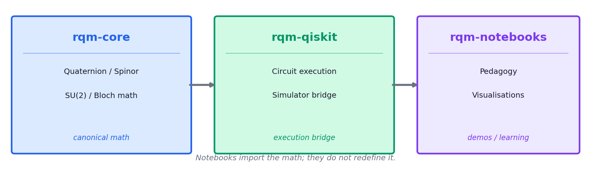
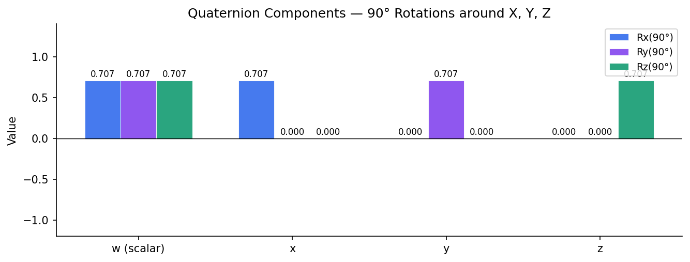
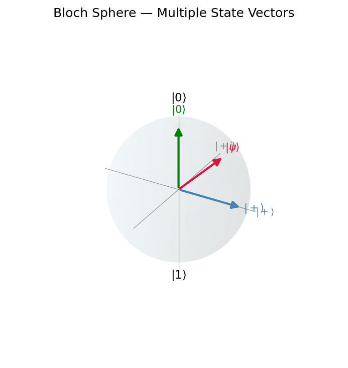
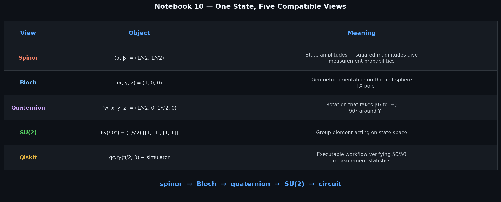

# rqm-notebooks

**Interactive notebooks for learning quaternion geometry, Bloch interpretation, SU(2) rotations, and Qiskit-backed workflows in the RQM ecosystem.**

---

## Better Coordinates for Better Measurement

This project uses quaternions because they preserve more of what physical systems are doing: phase, rotation, orientation, polarization, and coherence. Standard complex-number methods are powerful, but they can flatten these relationships too early. Quaternionic coordinates keep them together as one structured object, giving software a richer view of the measured system.

For RQM Technologies, better coordinates mean better measurement: more informative diagnostics, cleaner transformations, and more precise control across quantum, wave, sensing, imaging, and communications workflows.

---

## Stack placement

```
rqm-core  →  rqm-qiskit  →  rqm-notebooks
math         execution       demos / learning
```

| Layer | Role |
|---|---|
| **rqm-core** | Source of truth for all quaternion, spinor, Bloch sphere, and SU(2) mathematics |
| **rqm-qiskit** | Execution bridge — translates rqm-core types into Qiskit circuits and results |
| **rqm-notebooks** | Interactive demonstration layer — imports from both, adds only display helpers |

`rqm-core` provides the canonical math.
`rqm-qiskit` provides the execution bridge.
`rqm-notebooks` makes the system visible, teachable, and usable.

`qiskit` and `qiskit-aer` are **not** direct dependencies of `rqm-notebooks`; they
arrive as transitive dependencies of `rqm-qiskit`.  All circuit construction and
quantum execution in these notebooks goes through `rqm-qiskit`'s API.

---

## Architecture



> Notebooks import the math; they do not redefine it.

---

## Visual preview

### Quaternion Components



### Bloch Sphere



### Synthesis Table — One State, Five Compatible Views (Notebook 10)



---

## What you'll learn

| Topic | Description |
|---|---|
| Quaternion components and intuition | What quaternions are, why they matter, and how w/x/y/z encode rotations |
| Spinor ↔ Bloch interpretation | Connecting quantum state vectors to the Bloch sphere |
| SU(2) rotation geometry | SU(2) as the geometry underlying qubit operations |
| Simulator workflows | Sampling, measurement statistics, and circuit execution on Aer |
| IBM-ready path | Preparing circuits for real quantum hardware |

---

## Start here

Open these notebooks in order:

1. [`notebooks/00_welcome_and_repo_map.ipynb`](notebooks/00_welcome_and_repo_map.ipynb) — orientation and navigation
2. [`notebooks/01_quaternion_intuition.ipynb`](notebooks/01_quaternion_intuition.ipynb) — first principles
3. [`notebooks/05_rqm_qiskit_single_qubit_workflows.ipynb`](notebooks/05_rqm_qiskit_single_qubit_workflows.ipynb) — circuits and execution

---

## Three audience paths

Depending on your goal, follow one of these tracks:

| Audience | Recommended path |
|---|---|
| **Explorer** — just curious | 00 → 01 → 02 |
| **Quantum developer** — building with the stack | 00 → 05 → 06 |
| **Architecture reader** — understanding the design | 00 → 04 → 05 |

---

## Full notebook learning path

| Notebook | Topic |
|---|---|
| `00_welcome_and_repo_map.ipynb` | Orientation — what this repo is and how to navigate it |
| `01_quaternion_intuition.ipynb` | Building quaternion intuition from first principles |
| `02_spinor_to_bloch.ipynb` | From spinors to the Bloch sphere |
| `03_su2_rotations_and_geometry.ipynb` | SU(2) rotations and their geometric meaning |
| `04_rqm_core_as_source_of_truth.ipynb` | rqm-core as the canonical math layer |
| `05_rqm_qiskit_single_qubit_workflows.ipynb` | Single-qubit workflows via rqm-qiskit |
| `06_simulator_measurements.ipynb` | Simulator-first measurement workflows |
| `07_state_preparation_and_visual_checks.ipynb` | State preparation and visual verification |
| `08_gate_composition_as_geometry.ipynb` | Gate composition viewed as geometry |
| `09_ibm_ready_path.ipynb` | IBM hardware-ready examples |
| `10_one_state_three_views.ipynb` | One state, five compatible views — the full stack in one place |

---

## Quick start

```bash
# Install dependencies
pip install -r requirements.txt

# Launch JupyterLab
jupyter lab notebooks/
```

No IBM account or real quantum hardware is required. All notebooks run on a local Qiskit Aer simulator.

---

## Repository layout

```
rqm-notebooks/
├── notebooks/          # Pedagogical Jupyter notebooks (00–10)
├── helpers/            # Lightweight display/plotting utilities (no canonical math)
│   ├── plotting.py
│   ├── notebook_style.py
│   └── display_utils.py
├── assets/
│   ├── diagrams/       # Editable diagram sources (.svg, .drawio)
│   └── images/         # Static PNG/SVG exports for notebooks and docs
├── tests/              # Smoke tests — dependency imports and notebook structure
├── .github/workflows/  # CI: smoke-test on every push
├── pyproject.toml
├── requirements.txt
└── README.md
```

---

## Architectural rules

- **rqm-core** owns all math. Notebooks must not reimplement quaternion, spinor, Bloch, or SU(2) logic.
- **rqm-qiskit** owns circuit execution. Notebooks call its API, not raw Qiskit directly.
- **rqm-notebooks** declares `rqm-qiskit` as a direct dependency. `qiskit` and `qiskit-aer` are intentionally absent from the declared dependencies — they arrive transitively and are not part of this package's public contract.
- **helpers/** contains only display/formatting utilities — no canonical math.
- No IBM hardware dependency is required to run any notebook by default.

---

## Running tests

```bash
pytest tests/
```

---

## License

MIT — see [LICENSE](LICENSE).
